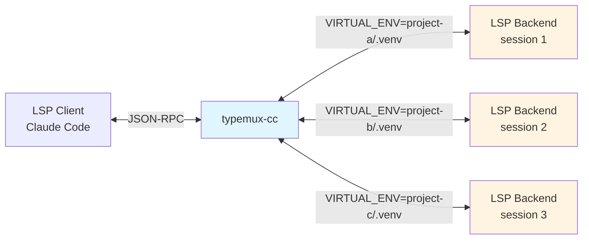
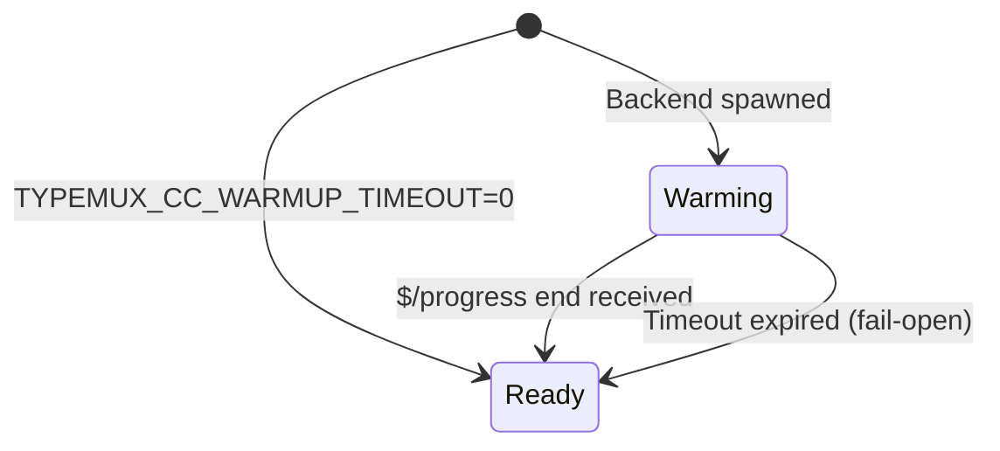
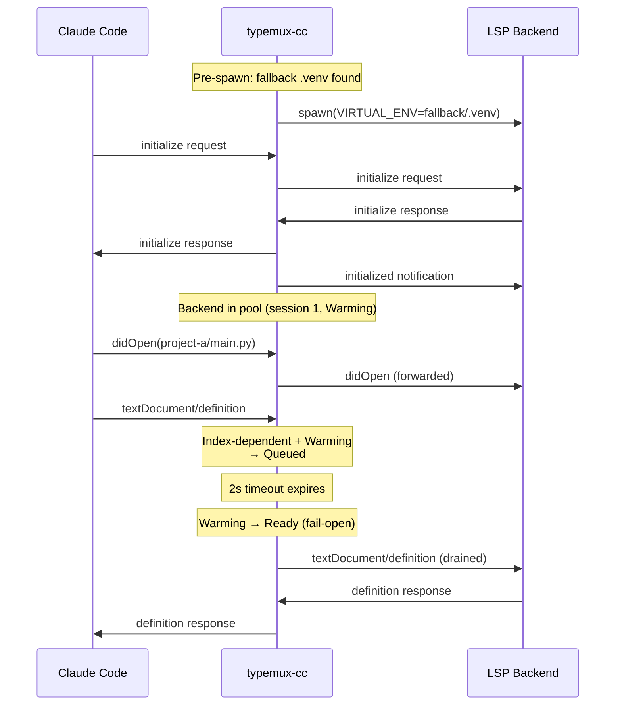
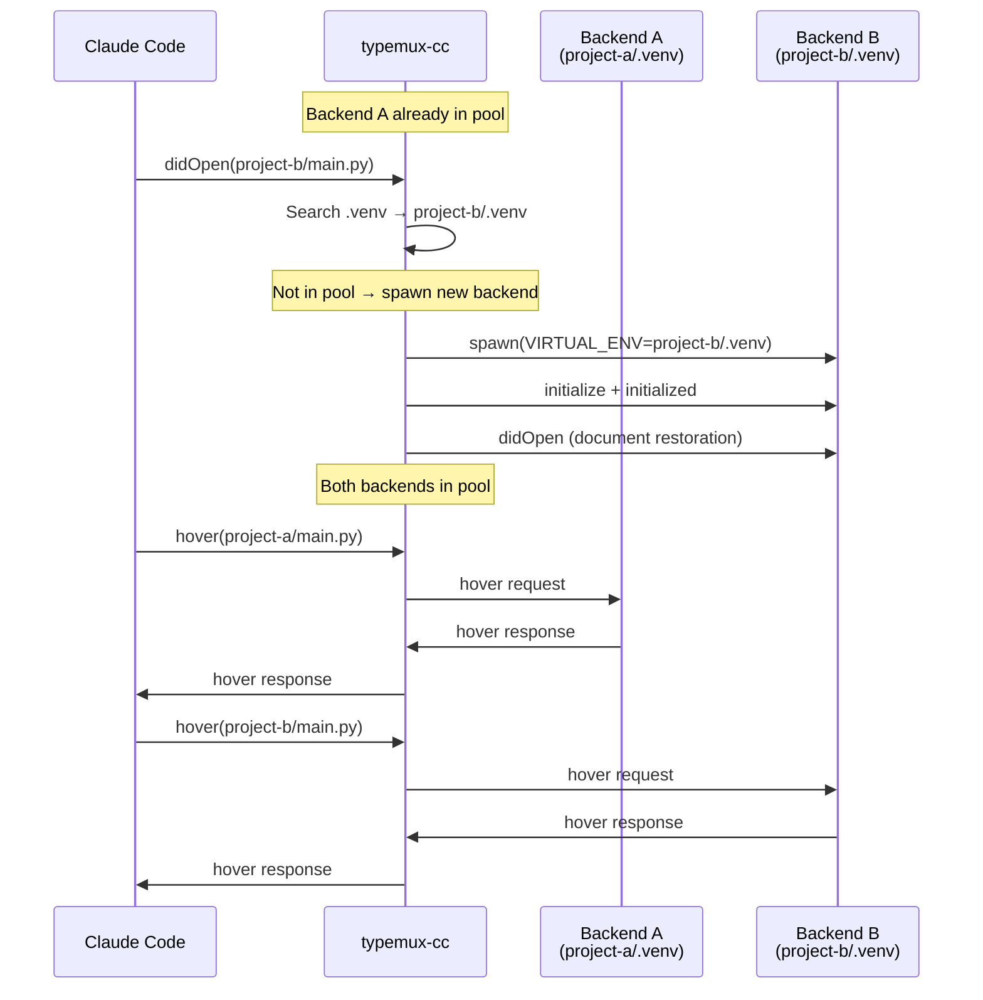
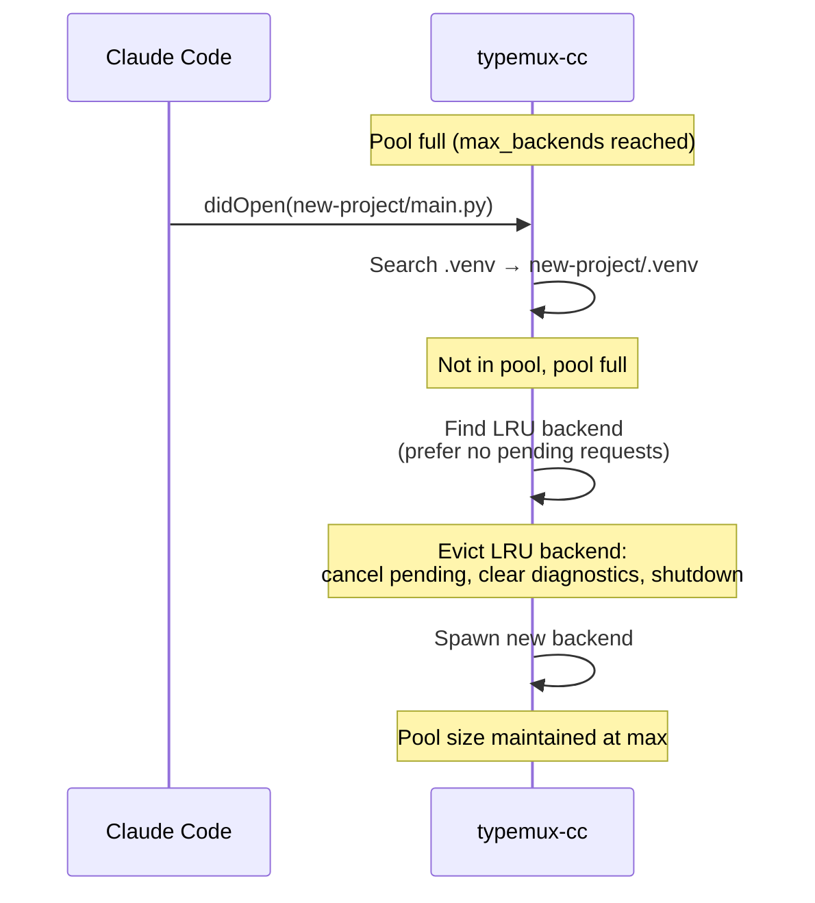
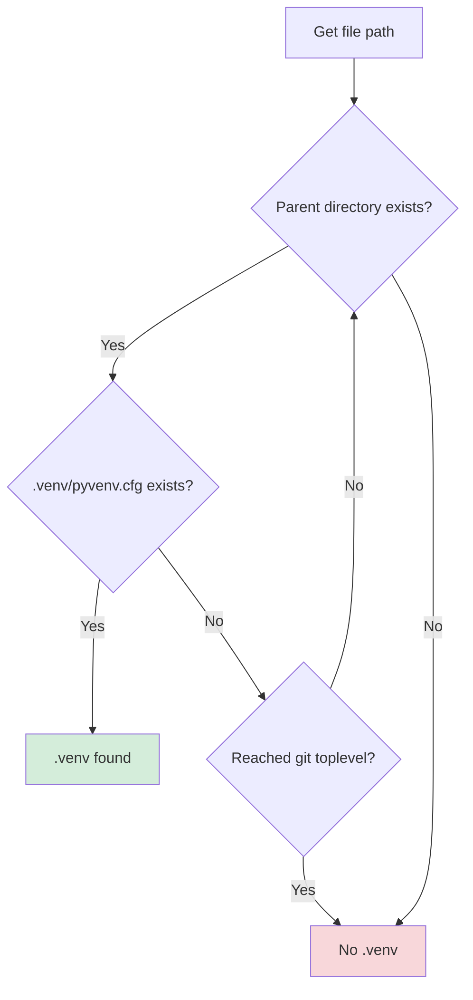

# Architecture

> This document explains _why_ typemux-cc is built this way.

Design philosophy, state transitions, and internal implementation details.
For usage, see [README.md](./README.md).

## Non-goals

- No support for LSP clients other than Claude Code
- No environment resolution for anything other than `.venv` (poetry/conda, etc.)
- No simultaneous parallel operation of multiple backend types (always one type per proxy instance)

## Background: Why This Tool Is Needed

### Python Type-Checker Limitation

Python type-checker LSP servers (pyright, ty, pyrefly) read environment variables `VIRTUAL_ENV` and `sys.path` at startup to determine the Python interpreter and dependencies ([LSP-pyright README](https://github.com/sublimelsp/LSP-pyright), [Pyright discussions #4420](https://github.com/microsoft/pyright/discussions/4420)). Creating `.venv` after startup doesn't cause already-running processes to reload environment variables.

### Claude Code's Limitation

Per LSP specification, dynamically changing environment variables requires restarting the language server process ([LSP Mode FAQ](https://emacs-lsp.github.io/lsp-mode/page/faq/), [Helix issue #9398](https://github.com/helix-editor/helix/issues/9398)). However, Claude Code's LSP plugin architecture has these constraints:

- Even if you manually kill the LSP process, Claude Code cannot reconnect to a new process
- Processes spawned by the plugin are tied to Claude Code's session lifecycle
- **As a result, enabling `.venv` requires restarting Claude Code itself**

typemux-cc breaks through this limitation by inserting a proxy between Claude Code and the backend.

## Design Principles

### "A Silently Lying LSP Is the Worst"

Running with the wrong `.venv` is worse than disabling LSP functionality and returning errors.

**Why?**

- Offering completions with wrong dependencies generates code that imports non-existent modules
- Type checking appears to pass, but fails at runtime
- Developers continue coding based on false information, believing "LSP is working"

**typemux-cc's Choice**

- **Explicitly return errors** when `.venv` is not found
- Explain the situation in error messages so users can take action
- "Getting an error" is healthier than "nothing happening"

## Architecture Overview

### Overall Structure



The proxy sits between Claude Code and multiple LSP backends (pyright, ty, or pyrefly), performing:

1. **Message routing**: Route JSON-RPC messages to the correct backend based on document venv
2. **venv detection**: Search for `.venv` on:
   - `textDocument/didOpen` (always)
   - LSP requests: hover, definition, references, documentSymbol, typeDefinition, implementation
   - NOTE: Cached documents reuse the last known venv and are not re-searched
3. **Multi-backend pool**: Manage concurrent backend processes (one per venv, up to `max_backends`)
4. **State restoration**: Resend open documents when spawning a new backend
5. **Diagnostics cleanup**: Clear diagnostics for documents outside the target venv
6. **Warmup readiness**: Queue index-dependent requests until backends finish building their cross-file index

## Multi-Backend Pool

### Design

Instead of running a single backend and restarting on venv changes, typemux-cc maintains a **pool of concurrent backend processes** — one per venv. This eliminates restart overhead when switching between projects in a monorepo.

### Pool Management

| Feature | Description | Configuration |
|---------|-------------|---------------|
| Max backends | Upper limit on concurrent backend processes | `--max-backends` / `TYPEMUX_CC_MAX_BACKENDS` (default: 8) |
| LRU eviction | When pool is full, evict the least recently used backend | Prefers backends with no pending requests |
| TTL eviction | Automatically evict idle backends after a timeout | `--backend-ttl` / `TYPEMUX_CC_BACKEND_TTL` (default: 1800s) |
| Session tracking | Each backend gets a unique session ID for stale message detection | Monotonically increasing counter |

### Session Tracking

```rust
pub struct BackendInstance {
    pub session: u64,       // Unique session ID
    pub last_used: Instant, // For LRU tracking
    // ...
}
```

Each backend gets a unique session ID. Pending requests store which session they were sent to. If a response arrives from an old session (evicted/crashed backend), it's discarded as stale.

```rust
pub struct PendingRequest {
    pub backend_session: u64, // Which backend session was this request sent to?
    pub venv_path: PathBuf,
}
```

## Backend-to-Client Request Proxying

LSP backends can send requests to the client (e.g., `window/workDoneProgress/create`). With multiple backends, their request IDs can collide.

### Solution: Proxy ID Rewriting

1. Backend sends request with its own ID (e.g., `id: 1`)
2. Proxy allocates a unique negative proxy ID (e.g., `id: -1`) to avoid collision with client IDs (positive)
3. Original ID is stored in `pending_backend_requests`
4. Message forwarded to client with rewritten ID
5. Client response routed back, ID restored to original

```rust
pub struct PendingBackendRequest {
    pub original_id: RpcId,   // Backend's original ID
    pub venv_path: PathBuf,
    pub session: u64,
}
```

## Warmup Readiness

### Problem

After spawning, backends need time to build their cross-file index. Requests sent during this warmup period return incomplete results:

- `findReferences` returns same-file results only (missing cross-project references)
- `goToDefinition` on re-exported symbols returns empty

### Solution: Warming/Ready State with Bounded Timeout



Each `BackendInstance` tracks its warmup state:

```rust
pub enum WarmupState {
    Warming, // Queueing index-dependent requests
    Ready,   // All requests forwarded normally
}
```

### Behavior During Warmup

| Request type | During Warming | After Ready |
|-------------|----------------|-------------|
| `textDocument/definition` | **Queued** | Forwarded |
| `textDocument/references` | **Queued** | Forwarded |
| `textDocument/implementation` | **Queued** | Forwarded |
| `textDocument/typeDefinition` | **Queued** | Forwarded |
| `textDocument/hover` | Forwarded immediately | Forwarded |
| `textDocument/documentSymbol` | Forwarded immediately | Forwarded |
| `textDocument/didOpen` | Forwarded immediately | Forwarded |
| Other requests/notifications | Forwarded immediately | Forwarded |

### Ready Transition Triggers (OR logic)

1. **`$/progress` notification** with `kind: "end"` received from backend
2. **Bounded timeout** (default 2s, configurable via `TYPEMUX_CC_WARMUP_TIMEOUT`) expires — **fail-open**: forward queued requests anyway

### Configuration

| Env var | Default | Description |
|---------|---------|-------------|
| `TYPEMUX_CC_WARMUP_TIMEOUT` | `2` (seconds) | Warmup timeout duration |
| `TYPEMUX_CC_WARMUP_TIMEOUT=0` | — | Disable warmup entirely (immediate Ready) |

## Strict Venv Mode

### Design Intent

As stated in the design principles, disabling is better than running with the wrong venv.
Strict Venv Mode implements this philosophy.

### Behavior

| Condition | Behavior |
|-----------|----------|
| File opened, `.venv` found, backend in pool | Forward to existing backend |
| File opened, `.venv` found, backend NOT in pool | Spawn new backend, add to pool |
| File opened, `.venv` NOT found | Return error (`-32603: .venv not found`) |
| Pool full, new backend needed | Evict LRU backend, then spawn new one |
| `initialize` (no fallback .venv) | Return success with `capabilities: {}` (prevents Claude Code error state) |

### Cache Limitation (Important)

When a document is already cached, its venv is not re-searched on request.
This means creating `.venv` **after** opening a file will not take effect for that file
until it is reopened (or the document cache is refreshed).

## Operation Sequences

### Sequence 1: Startup with Fallback Venv



### Sequence 2: Multi-Venv Routing



### Sequence 3: LRU Eviction



## `.venv` Search Logic

### Search Algorithm



### Search Rules

1. **Starting point**: Parent directory of opened file
2. **Verification**: Check existence of `.venv/pyvenv.cfg`
3. **Boundary**: git toplevel (git repository root obtained at startup)
4. **Direction**: Traverse parent directories upward

### Fallback `.venv` Search Order

Determines initial virtual environment at startup:

1. `.venv` at git toplevel
2. `.venv` at cwd (current working directory)
3. Start without venv if neither exists

## Document State Cache

The proxy internally holds file contents received via `textDocument/didOpen` and `textDocument/didChange`.

### Why Needed?

1. **Restoration on Backend Spawn**

   - After starting backend with new venv, open files need to be resent
   - Client (Claude Code) still has files open, so backend state must be restored

2. **Revival Preparation While No Backend**
   - Even without an active backend for a document's venv, `didChange` contents continue to be recorded
   - When the correct backend is spawned later, it starts with the latest document state

### Cached Information

- File URI
- languageId (`python`, etc.)
- Version number
- Full text content
- Associated venv path

### Storage

- **Memory only** (not saved to disk)
- Cleared when proxy process terminates
- Automatically cleared when Claude Code restarts

### Selective Restoration

When spawning a backend for project-b/.venv, only documents under project-b/ are restored.
Documents under project-a/ are skipped. Skipped documents get empty diagnostics sent to clear stale errors.

## Main Features

| Feature | Description |
|---------|-------------|
| JSON-RPC framing | Read/write LSP messages with Content-Length headers |
| Multi-backend pool | Concurrent backend processes, one per venv |
| LRU eviction | Evict least recently used backend when pool is full |
| TTL-based eviction | Auto-evict idle backends (default: 30 min) |
| `.venv` auto-detection | Detect by traversing parent directories |
| Fallback `.venv` | Pre-spawn backend with initial venv at startup |
| Warmup readiness | Queue index-dependent requests until backend index is built |
| Document state caching | Remember open file contents for restoration |
| Selective restoration | Restore only documents under the target venv |
| Incremental sync | `textDocument/didChange` partial update support |
| Backend→client proxying | Proxy ID rewriting for multiplexed backend requests |
| `$/cancelRequest` handling | Cancel warmup-queued requests without forwarding |
| Strict venv mode | Return errors when no venv found |
| Diagnostics cleanup | Clear stale diagnostics on backend eviction |

## Logging Configuration

### Method 1: Environment Variables (Quick)

```bash
TYPEMUX_CC_LOG_FILE=/tmp/typemux-cc.log ./target/release/typemux-cc
RUST_LOG=debug ./target/release/typemux-cc
```

### Method 2: Config File (Persistent)

When running as a Claude Code plugin, the wrapper script loads config from:

```bash
~/.config/typemux-cc/config
```

**Setup**:

```bash
mkdir -p ~/.config/typemux-cc
cat > ~/.config/typemux-cc/config << 'EOF'
# Select backend (pyright, ty, or pyrefly)
export TYPEMUX_CC_BACKEND="ty"

# Enable file output
export TYPEMUX_CC_LOG_FILE="/tmp/typemux-cc.log"

# Adjust log level (optional)
export RUST_LOG="typemux_cc=debug"
EOF

# Restart Claude Code
```

### Log Levels

| Level   | Use Case                                      |
|---------|-----------------------------------------------|
| `debug` | Default. venv search details, LSP message method names |
| `info`  | venv switches, session info, warmup transitions |
| `trace` | All search steps, detailed debugging          |

### Useful Queries

```bash
# Real-time monitoring
tail -f /tmp/typemux-cc.log

# Warmup transitions
grep "warmup" /tmp/typemux-cc.log

# Backend pool activity
grep -E "(Creating new backend|Evicting|Backend warmup)" /tmp/typemux-cc.log

# Document restoration stats
grep "Document restoration completed" /tmp/typemux-cc.log

# Session transitions
grep "session=" /tmp/typemux-cc.log | grep -E "(Starting|completed)"
```

## Development

### Build & Test

```bash
# Format + Lint + Test
make all

# Individual commands
make fmt      # Code formatting
make lint     # Static analysis with clippy
make test     # Run unit tests
make release  # Release build

# For CI (includes format check)
make ci
```

### Source Code Structure

| File | Responsibility |
|------|----------------|
| `main.rs` | Entry point, CLI argument parsing, logging setup |
| `backend.rs` | LSP backend process management (pyright, ty, pyrefly) |
| `backend_pool.rs` | Multi-backend pool, LRU/TTL management, warmup state |
| `state.rs` | Proxy state: pool, documents, pending requests |
| `message.rs` | JSON-RPC message type definitions (RpcMessage, RpcId, RpcError) |
| `framing.rs` | JSON-RPC framing (Content-Length header processing) |
| `text_edit.rs` | Incremental text edit application for didChange |
| `venv.rs` | `.venv` search logic (parent traversal, git toplevel boundary) |
| `error.rs` | Error type definitions (ProxyError, BackendError, etc.) |
| `proxy/mod.rs` | Main event loop (`tokio::select!` with 4 arms) |
| `proxy/client_dispatch.rs` | Client message routing, warmup queueing, cancel handling |
| `proxy/backend_dispatch.rs` | Backend message routing, proxy ID rewriting, progress detection |
| `proxy/pool_management.rs` | LRU/TTL eviction, crash recovery, warmup expiry |
| `proxy/initialization.rs` | Backend initialization handshake, document restoration |
| `proxy/document.rs` | Document tracking (didOpen, didChange, didClose) |
| `proxy/diagnostics.rs` | Diagnostic message handling, stale diagnostics cleanup |

### Event Loop

The main event loop in `proxy/mod.rs` uses `tokio::select!` with 4 arms:

```
┌─────────────────────────────────────────────────────┐
│                  tokio::select!                     │
├─────────────────────────────────────────────────────┤
│ 1. Client reader     │ stdin JSON-RPC messages      │
│ 2. Backend reader    │ mpsc channel (all backends)  │
│ 3. TTL timer         │ 60s interval sweep           │
│ 4. Warmup timer      │ nearest warmup deadline      │
└─────────────────────────────────────────────────────┘
```
