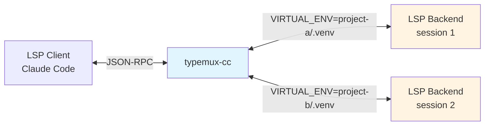
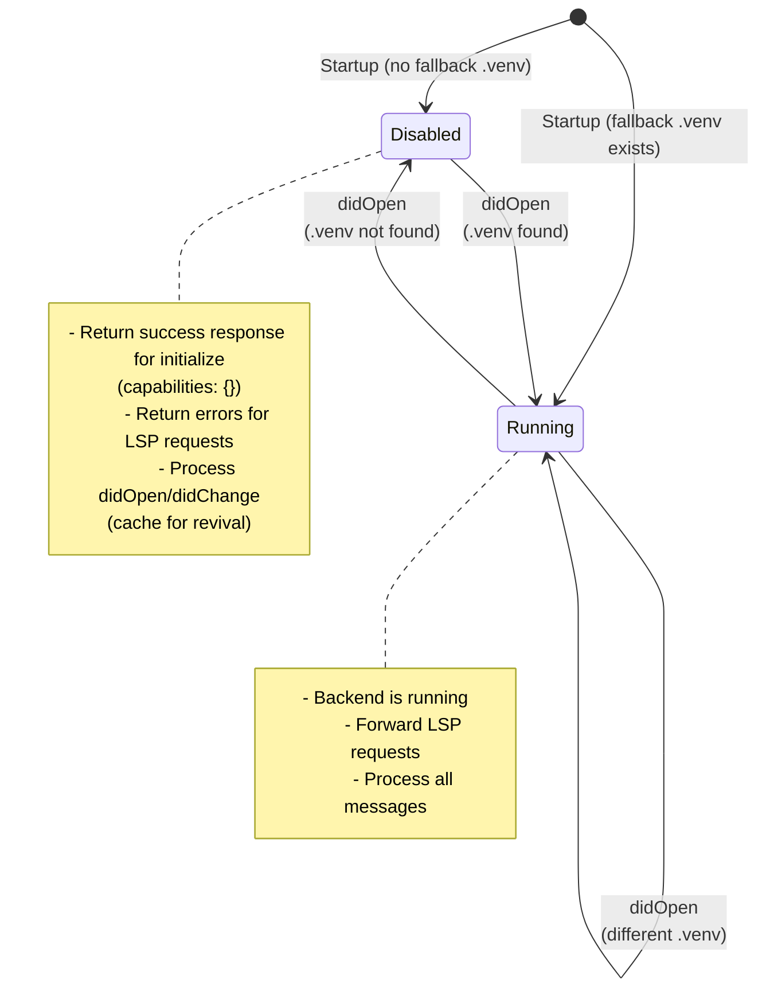
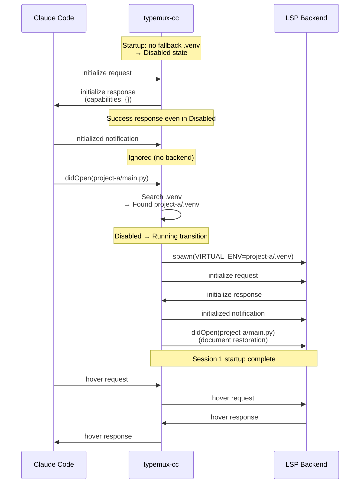
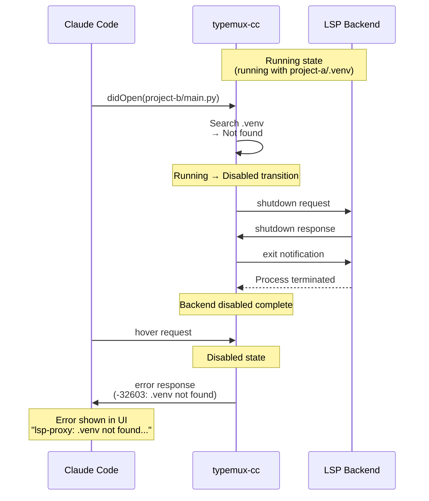
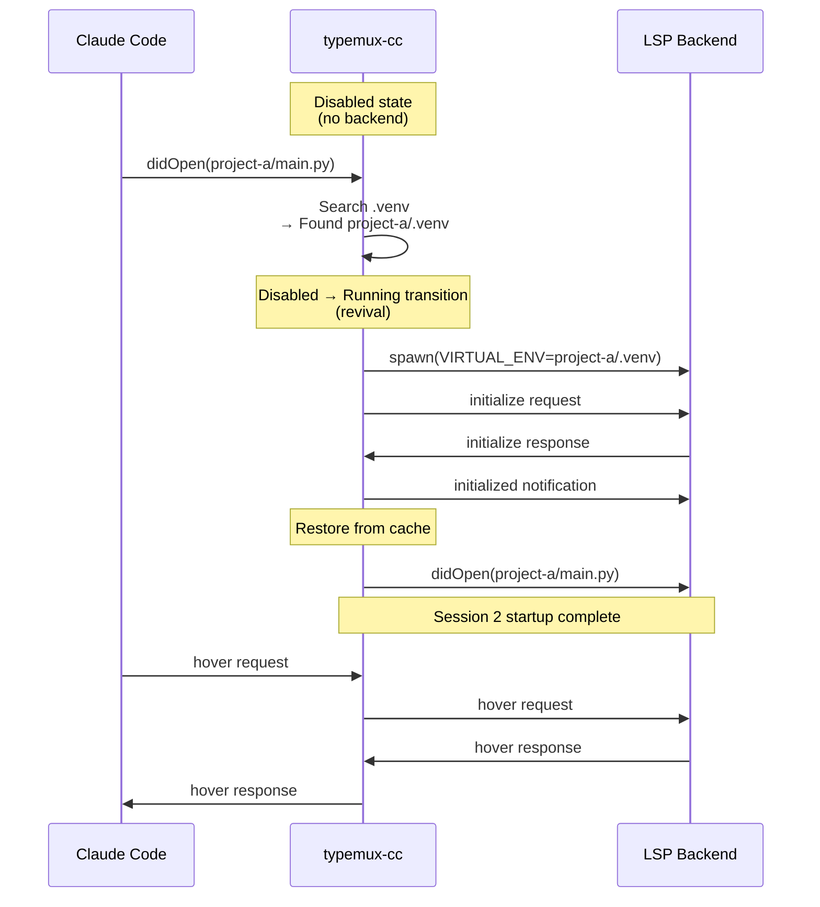
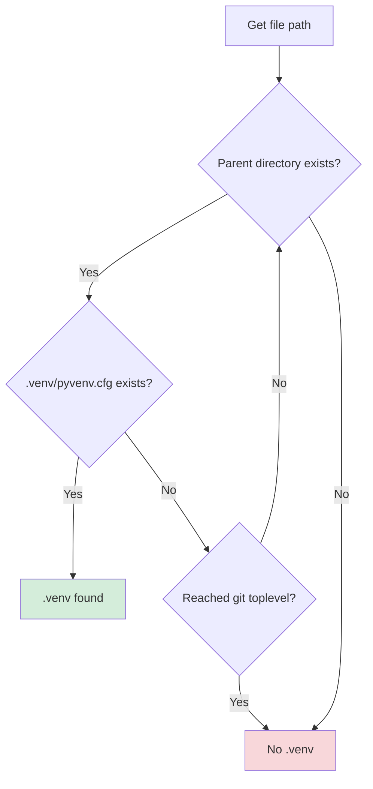

# Architecture

> This document explains _why_ typemux-cc is built this way.

Design philosophy, state transitions, and internal implementation details.
For usage, see [README.md](./README.md).

## Non-goals

- No support for LSP clients other than Claude Code
- No environment resolution for anything other than `.venv` (poetry/conda, etc.)
- No simultaneous parallel operation of multiple backend types (always one type per proxy instance)

## Background: Why This Tool Is Needed

### Python Type-Checker Limitation

Python type-checker LSP servers (pyright, ty, pyrefly) read environment variables `VIRTUAL_ENV` and `sys.path` at startup to determine the Python interpreter and dependencies ([LSP-pyright README](https://github.com/sublimelsp/LSP-pyright), [Pyright discussions #4420](https://github.com/microsoft/pyright/discussions/4420)). Creating `.venv` after startup doesn't cause already-running processes to reload environment variables.

### Claude Code's Limitation

Per LSP specification, dynamically changing environment variables requires restarting the language server process ([LSP Mode FAQ](https://emacs-lsp.github.io/lsp-mode/page/faq/), [Helix issue #9398](https://github.com/helix-editor/helix/issues/9398)). However, Claude Code's LSP plugin architecture has these constraints:

- Even if you manually kill the LSP process, Claude Code cannot reconnect to a new process
- Processes spawned by the plugin are tied to Claude Code's session lifecycle
- **As a result, enabling `.venv` requires restarting Claude Code itself**

typemux-cc breaks through this limitation by inserting a proxy between Claude Code and the backend.

## Design Principles

### "A Silently Lying LSP Is the Worst"

Running with the wrong `.venv` is worse than disabling LSP functionality and returning errors.

**Why?**

- Offering completions with wrong dependencies generates code that imports non-existent modules
- Type checking appears to pass, but fails at runtime
- Developers continue coding based on false information, believing "LSP is working"

**typemux-cc's Choice**

- **Explicitly return errors** when `.venv` is not found
- Explain the situation in error messages so users can take action
- "Getting an error" is healthier than "nothing happening"

## Architecture Overview

### Overall Structure



The proxy sits between Claude Code and the LSP backend (pyright, ty, or pyrefly), performing:

1. **Message relay**: Bidirectional forwarding of JSON-RPC messages
2. **venv detection**: Search for `.venv` on:
   - `textDocument/didOpen` (always)
   - LSP requests: hover, definition, references, documentSymbol, typeDefinition, implementation
   - NOTE: Cached documents reuse the last known venv and are not re-searched
3. **Backend management**: Restart LSP backend when venv changes
4. **State restoration**: Resend open documents after restart
5. **Diagnostics cleanup**: Clear diagnostics for documents outside the switch target

## Strict Venv Mode

### Design Intent

As stated in the design principles, disabling is better than running with the wrong venv.
Strict Venv Mode implements this philosophy.

### State Transitions



### State-specific Behavior

| State        | LSP Requests                                 | didOpen                         | didChange/didClose                          | Notes            |
| ------------ | -------------------------------------------- | ------------------------------- | ------------------------------------------- | ---------------- |
| **Running**  | Forward to backend                           | Search .venv → state transition | Update cache → forward to backend           | Normal operation |
| **Disabled** | Return error<br/>(`-32603: .venv not found`) | Search .venv → revival trigger  | Update cache only<br/>(not sent to backend) | LSP disabled     |

### Key Implementation Points

1. **initialize Always Succeeds**

   - Return success response to `initialize` request even in Disabled state
   - Notify no LSP capabilities with `capabilities: {}`
   - Prevents Claude Code from entering `server is error` state

2. **Cache Updates Continue While Disabled**

   - Continue recording `didChange`/`didClose` state
   - For restoring correct document state upon revival

3. **Error Messages Are Logged**
   - Log when JSON-RPC error responses are returned
   - For debugging and monitoring

## Operation Sequences

### Sequence 1: Startup → Open project-a (.venv exists)



### Sequence 2: project-a → Open project-b (no .venv)



### Sequence 3: project-b (Disabled) → Return to project-a (.venv exists)



### Operation Flow (Summary)

1. Client opens a file with `textDocument/didOpen`
2. Proxy searches for `.venv` from file path
3. State transition decision:
   - **Running + .venv found (same)** → Do nothing
   - **Running + .venv found (different)** → Switch backend
   - **Running + .venv not found** → Transition to Disabled (shutdown)
   - **Disabled + .venv found** → Transition to Running (spawn)
   - **Disabled + .venv not found** → Stay as is
4. Handle LSP requests appropriately:
   - Running: Proxy to backend
   - Disabled: Return error response

## Main Features

| Feature                    | Description                                 |
| -------------------------- | ------------------------------------------- |
| JSON-RPC framing           | Read/write LSP messages                     |
| Backend process management | Backend startup/shutdown control            |
| `.venv` auto-detection     | Detect by traversing parent directories     |
| Fallback `.venv`           | Initial venv at startup (cwd/git toplevel)  |
| Backend auto-switching     | Restart on `.venv` change                   |
| **Document state caching** | **Remember open file contents**             |
| Document restoration       | Resend open files after switch              |
| Selective restoration      | Restore only under `.venv` parent directory |
| Incremental Sync           | `textDocument/didChange` partial update     |
| Transparent switch         | Switch backend before sending the request   |
| Strict Venv Mode           | Disable backend when no venv                |

## Document State Cache

The proxy internally holds file contents received via `textDocument/didOpen` and `textDocument/didChange`.

### Why Needed?

1. **Restoration on Backend Switch**

   - After starting backend with new venv, open files need to be resent
   - Client (Claude Code) still has files open, so backend state must be restored

2. **Revival Preparation While Disabled**
   - Even if backend is disabled due to missing venv, `didChange` contents continue to be recorded
   - When correct venv is found later, backend can start with latest state

### Cached Information

- File URI
- languageId (`python`, etc.)
- Version number
- Full text content

### Storage Location

- **Memory only** (not saved to disk)
- Cleared when proxy process terminates
- Automatically cleared when Claude Code restarts
- No cleanup needed on uninstall

### Memory Efficiency

- Removed from cache on `didClose`
- Only necessary files are held
- Typically a few files (hundreds of KB to a few MB)

### Selective Restoration Example

When switching from project-a/.venv to project-b/.venv:

**Open documents**:

- `project-a/main.py` (version 1)
- `project-a/utils.py` (version 1)
- `project-b/main.py` (version 1)

**Restoration behavior**:

- ✅ `project-b/main.py` → Restored (same venv parent)
- ❌ `project-a/main.py` → Skipped (different venv)
- ❌ `project-a/utils.py` → Skipped (different venv)

**Diagnostics clearing**:

- Skipped documents get empty diagnostics sent to client
- This clears stale errors from the old venv

## Transparent Switch

### The Problem

When venv switched, previously pending requests were cancelled and returned `RequestCancelled`.
This looked like "hover sometimes fails" to users.

### The Solution

The proxy now:

1. Detects venv change **before** sending the request
2. Switches backend (shutdown old, spawn new)
3. Sends the request to the **new backend**
4. Returns response to user

From the user's perspective: **Hover/definition/etc. succeed on first try, even after venv switch.**

### Implementation

#### Session Tracking

```rust
pub enum BackendState {
    Running {
        backend: Box<LspBackend>,
        active_venv: PathBuf,
        session: u64,  // ★ Tracks which backend generation
    },
    // ...
}
```

Each backend gets a unique session ID. Pending requests store which session they were sent to.

#### Stale Response Detection

```rust
pub struct PendingRequest {
    pub backend_session: u64,  // Which backend was this request sent to?
}
```

If a response arrives from an old session (e.g., session=5 but current is session=6), it's discarded as stale.

#### Flow

```
1. User hovers on project-a file
2. ensure_backend_for_uri() detects project-a/.venv
3. (Switch occurs: session 5 → 6)
4. Request sent to session 6
5. Response arrives from session 6
6. User sees hover result (transparent!)
```

**Safety Mechanisms**:

- Stale response check: `pending.backend_session != running.session` → discard
- Session-specific pending cancellation: Only cancel requests from old session

### Cache Limitation (Important)

When a document is already cached, its venv is not re-searched on request.
This means creating `.venv` **after** opening a file will not take effect for that file
until it is reopened (or the document cache is refreshed).

## `.venv` Search Logic

### Search Algorithm



### Search Rules

1. **Starting point**: Parent directory of opened file
2. **Verification**: Check existence of `.venv/pyvenv.cfg`
3. **Boundary**: git toplevel (git repository root obtained at startup)
4. **Direction**: Traverse parent directories upward

### Fallback `.venv` Search Order

Determines initial virtual environment at startup:

1. `.venv` at git toplevel
2. `.venv` at cwd (current working directory)
3. Start without venv if neither exists

## Logging Configuration

### Method 1: Environment Variables (Quick)

```bash
TYPEMUX_CC_LOG_FILE=/tmp/typemux-cc.log ./target/release/typemux-cc
RUST_LOG=debug ./target/release/typemux-cc
```

### Method 2: Config File (Persistent)

When running as a Claude Code plugin, the wrapper script loads config from:

```bash
~/.config/typemux-cc/config
```

**Setup**:

```bash
mkdir -p ~/.config/typemux-cc
cat > ~/.config/typemux-cc/config << 'EOF'
# Enable file output
export TYPEMUX_CC_LOG_FILE="/tmp/typemux-cc.log"

# Adjust log level (optional)
export RUST_LOG="typemux_cc=debug"
EOF

# Restart Claude Code
```

### Log Levels

| Level   | Use Case                                      |
| ------- | --------------------------------------------- |
| `debug` | Default. venv search details, LSP message method names |
| `info`  | venv switches, session info only              |
| `trace` | All search steps, detailed debugging          |

### Useful Queries

```bash
# Real-time monitoring
tail -f /tmp/typemux-cc.log

# Venv switches only
grep "Venv switched" /tmp/typemux-cc.log

# Document restoration stats
grep "Document restoration completed" /tmp/typemux-cc.log

# Session transitions
grep "session=" /tmp/typemux-cc.log | grep -E "(Starting|completed)"
```

## Development

### Build & Test

```bash
# Format + Lint + Test
make all

# Individual commands
make fmt      # Code formatting
make lint     # Static analysis with clippy
make test     # Run unit tests
make release  # Release build

# For CI (includes format check)
make ci
```

### Running Tests

```bash
# All tests
cargo test

# venv search tests only
cargo test test_find_venv

# With detailed logs
RUST_LOG=debug cargo test
```

### Source Code Structure

| File         | Responsibility                                      |
| ------------ | --------------------------------------------------- |
| `main.rs`    | Entry point, logging setup                          |
| `proxy.rs`   | LSP message routing, backend switch control         |
| `backend.rs` | LSP backend process management (pyright, ty, pyrefly) |
| `venv.rs`    | `.venv` search logic                                |
| `state.rs`   | Proxy state management (open documents, session ID) |
| `message.rs` | JSON-RPC message type definitions                   |
| `framing.rs` | JSON-RPC framing (Content-Length header processing) |
| `error.rs`   | Error type definitions                              |
