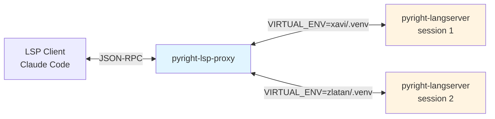
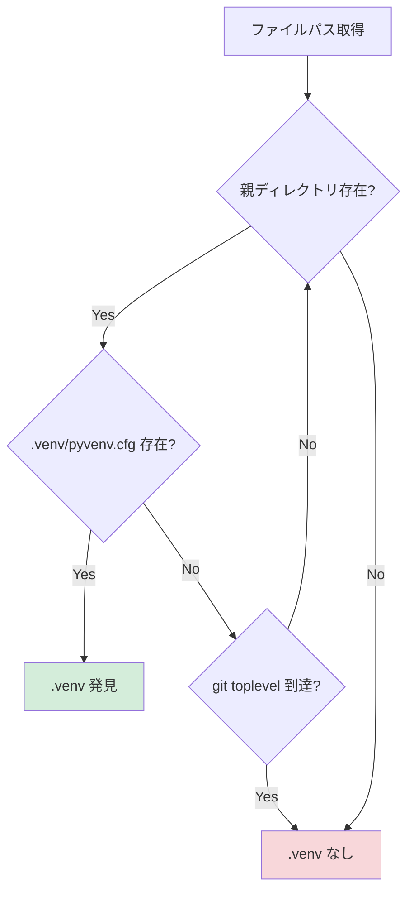

# pyright-lsp-proxy

Pyright Language Server のプロキシ。モノレポ環境で Python ファイルごとに自動的に `.venv` を切り替える。

## 概要

ファイルごとに異なる Python 仮想環境が必要な開発環境において、開いたファイルのコンテキストに応じて動的に `.venv` を検出し、Pyright Language Server のバックエンドを透過的に切り替える LSP プロキシ。

### 解決する問題

#### 問題 1: モノレポでの `.venv` 管理

モノレポで複数の Python プロジェクトを管理する場合、各プロジェクトが独自の依存関係を持つため `.venv` が分離される。しかし、通常の Pyright LSP は単一の仮想環境しか扱えないため、プロジェクト間を移動するたびに以下の問題が発生する：

- 型チェックが誤った依存関係を参照する
- 補完候補が不正確になる
- import エラーが誤検出される

#### 問題 2: Git Worktree での動的 `.venv` 作成

AI コーディング時代の開発では `git worktree` を使った並行作業が一般的だが、以下の問題が発生する：

**シナリオ**:
1. `git worktree add feature-branch` で新しい作業ツリーを作成
2. 作業ツリーに移動して Claude Code を起動
3. **この時点では `.venv` は存在しない**
4. hooks や自動化スクリプトで `.venv` を後から作成
5. しかし **Pyright LSP は `.venv` を認識しない**

**なぜ認識されないのか**:

Pyright langserver は起動時に環境変数 `VIRTUAL_ENV` や `sys.path` を読み込み、それを基に Python インタープリタと依存関係を決定する ([LSP-pyright README](https://github.com/sublimelsp/LSP-pyright), [Pyright discussions #4420](https://github.com/microsoft/pyright/discussions/4420))。起動後に `.venv` を作成しても、既に起動済みのプロセスは環境変数を再読み込みしない。

**従来の解決策の限界**:

LSP の仕様上、環境変数を動的に変更するには言語サーバープロセスの再起動が必要 ([LSP Mode FAQ](https://emacs-lsp.github.io/lsp-mode/page/faq/), [Helix issue #9398](https://github.com/helix-editor/helix/issues/9398))。しかし、Claude Code の LSP プラグインアーキテクチャでは以下の制限がある：

- LSP プロセスを手動で kill しても、Claude Code は新しいプロセスへ再接続できない
- プラグインが spawn したプロセスは Claude Code のセッションライフサイクルに紐付いている
- **結果として、`.venv` を有効にするには Claude Code 自体を再起動する必要がある**

**pyright-lsp-proxy の解決方法**:

プロキシが `.venv` の変更を検出すると、バックグラウンドで pyright-langserver を再起動し、開いているドキュメントを自動的に復元する。Claude Code は常にプロキシと通信しているため、バックエンドの切り替えに気づかず、**再起動不要で新しい `.venv` が有効化される**。

### アーキテクチャ



**動作フロー**

1. クライアントが `textDocument/didOpen` でファイルを開く
2. プロキシがファイルパスから `.venv` を探索
3. 現在のバックエンドと異なる `.venv` が見つかった場合：
   - 既存バックエンドを graceful shutdown
   - 新しい `.venv` で pyright-langserver を起動
   - 同じ `.venv` 配下の開いているドキュメントを復元
4. LSP リクエストを適切なバックエンドにプロキシ

## 主な機能

| 機能 | 説明 | 実装状況 |
|------|------|----------|
| JSON-RPC フレーミング | LSP メッセージの読み書き | ✅ 完了 |
| Pyright プロセス管理 | バックエンドの起動・終了制御 | ✅ 完了 |
| `.venv` 自動探索 | ファイルから親ディレクトリを辿って検出 | ✅ 完了 |
| Fallback `.venv` | 起動時の初期仮想環境（cwd/git toplevel） | ✅ 完了 |
| バックエンド自動切替 | `.venv` 変更時の再起動 | ✅ 完了 |
| ドキュメント復元 | 切替後に開いているファイルを再送信 | ✅ 完了 |
| 選択的復元 | 同じ venv 配下のドキュメントのみ復元 | ✅ 完了 |
| Incremental Sync | `textDocument/didChange` 部分更新対応 | ✅ 完了 |
| リクエストキャンセル | 再起動時の未解決リクエスト通知 | ✅ 完了 |

## 動作環境

### 対応OS

- macOS
- Linux

Windows は現在未対応（パス処理の違いにより）。

### 必須要件

- Rust 1.75 以上（ビルド時）
- `pyright-langserver` コマンドが PATH に存在すること
- Git（`.venv` 探索の上限決定に使用、なくても動作する）

## インストール

### 方法 A：GitHub Marketplace から（推奨）

```bash
# 1. GitHub リポジトリから Marketplace を追加
/plugin marketplace add K-dash/pyright-lsp-proxy

# 2. プラグインをインストール
/plugin install pyright-lsp-proxy@pyright-lsp-proxy

# 3. 公式 pyright プラグインを無効化（競合回避）
# Claude Code の設定で pyright-lsp@claude-plugins-official を無効にしてください
```

インストール後、`~/.claude/settings.json` で以下を確認：

```json
{
  "enabledPlugins": {
    "pyright-lsp@claude-plugins-official": false,
    "pyright-lsp-proxy@pyright-lsp-proxy": true
  }
}
```

### 方法 B：ローカルビルド（開発者向け）

```bash
# 1. リポジトリをクローン
git clone https://github.com/K-dash/pyright-lsp-proxy.git
cd pyright-lsp-proxy

# 2. リリースビルド
cargo build --release

# 3. ローカル Marketplace として追加
/plugin marketplace add /path/to/pyright-lsp-proxy

# 4. プラグインをインストール
/plugin install pyright-lsp-proxy@pyright-lsp-proxy-marketplace
```

バイナリは `target/release/pyright-lsp-proxy` に生成される。

## 使い方

### 基本的な実行

Claude Code のプラグインとして使う場合は自動的に起動される。

手動実行する場合：

```bash
# リリースビルドを実行（デフォルト：stderr のみ）
./target/release/pyright-lsp-proxy

# ヘルプを表示
./target/release/pyright-lsp-proxy --help
```

### ログ設定

#### デフォルト動作（stderr のみ）

プラグインとして使う場合、ログは Claude Code のターミナルに自動的に表示される。

```bash
# 特別な設定不要（デフォルトで stderr に出力）
./target/release/pyright-lsp-proxy
```

#### ファイルにもログを出力したい場合

**方法 1：環境変数で設定（推奨）**

`~/.claude/settings.json` に追加：

```json
{
  "env": {
    "PYRIGHT_LSP_PROXY_LOG_FILE": "/tmp/pyright-lsp-proxy.log"
  }
}
```

**方法 2：コマンドライン引数（ローカルビルド時）**

```bash
./target/release/pyright-lsp-proxy --log-file /tmp/pyright-lsp-proxy.log
```

ファイル出力を指定した場合、**stderr とファイルの両方**にログが出力される。

### ログの確認

```bash
# リアルタイムでログを監視
tail -f /tmp/pyright-lsp-proxy.log

# venv 切り替えログのみ抽出
grep "Venv switch needed" /tmp/pyright-lsp-proxy.log

# ドキュメント復元の統計を確認
grep "Document restoration completed" /tmp/pyright-lsp-proxy.log
```

### ログレベルの調整

環境変数 `RUST_LOG` で制御。`~/.claude/settings.json` に追加：

```json
{
  "env": {
    "RUST_LOG": "pyright_lsp_proxy=debug"
  }
}
```

| レベル | 用途 |
|--------|------|
| `info` | デフォルト。venv 切替・session 情報のみ |
| `debug` | venv 探索の詳細、LSP メッセージのメソッド名 |
| `trace` | 全ての探索ステップ、詳細なデバッグ情報 |

## 典型的な使用例

### モノレポ構成

```
rcmr_stadium/
├── xavi/
│   ├── .venv/          # xavi 専用の仮想環境
│   └── xavi/
│       └── usecase.py
├── zlatan/
│   ├── .venv/          # zlatan 専用の仮想環境
│   └── zlatan/
│       └── usecase.py
└── zidane/
    ├── .venv/          # zidane 専用の仮想環境
    └── zidane/
        └── usecase.py
```

### 動作シーケンス

| 操作 | プロキシの動作 | ログ出力例 |
|------|---------------|-----------|
| 1. Claude Code 起動 | fallback .venv 探索（未検出なら venv なしで起動） | `WARN No fallback .venv found, starting without venv` |
| 2. `xavi/usecase.py` を開く | `xavi/.venv` を検出 → session 1 起動 | `INFO .venv found venv=/path/to/xavi/.venv depth=3` |
| 3. `zlatan/usecase.py` を開く | `zlatan/.venv` を検出 → session 2 へ切替 | `WARN Venv switch needed current=xavi/.venv found=zlatan/.venv` |
| 4. session 2 起動完了 | zlatan 配下のドキュメントのみ復元 | `INFO Document restoration completed restored=1 skipped=1` |

この例では、`xavi/usecase.py` は異なる venv なのでスキップされ、`zlatan/usecase.py` のみが復元される。

## `.venv` 探索ロジック

### 探索アルゴリズム



### 探索ルール

1. **起点**: 開かれたファイルの親ディレクトリ
2. **検証**: `.venv/pyvenv.cfg` の存在確認
3. **上限**: git toplevel（git リポジトリのルート）
4. **方向**: 親ディレクトリを順次遡る

### Fallback `.venv` の探索順序

起動時に初期仮想環境を決定：

1. git toplevel の `.venv`
2. cwd（カレントディレクトリ）の `.venv`
3. どちらも存在しない場合は venv なしで起動

## 開発

### ビルド・テスト

```bash
# フォーマット + Lint + テスト
make all

# 個別実行
make fmt      # コードフォーマット
make lint     # clippy による静的解析
make test     # ユニットテスト実行
make release  # リリースビルド

# CI用（フォーマットチェック含む）
make ci
```

### テスト実行

```bash
# 全テスト
cargo test

# venv 探索のテストのみ
cargo test test_find_venv

# 詳細ログ付き
RUST_LOG=debug cargo test
```

### ソースコード構成

| ファイル | 責務 | 行数 |
|---------|------|------|
| `main.rs` | エントリポイント、ログ設定 | 62 |
| `proxy.rs` | LSP メッセージルーティング、バックエンド切替制御 | 900+ |
| `backend.rs` | pyright-langserver プロセス管理 | 150+ |
| `venv.rs` | `.venv` 探索ロジック | 200+ |
| `state.rs` | プロキシの状態管理（開いているドキュメント、session ID） | 100+ |
| `message.rs` | JSON-RPC メッセージ型定義 | 150+ |
| `framing.rs` | JSON-RPC フレーミング（Content-Length ヘッダ処理） | 100+ |
| `error.rs` | エラー型定義 | 50+ |

総行数: 約 1700 行

### 主要な依存関係

| crate | 用途 |
|-------|------|
| `tokio` | 非同期ランタイム |
| `serde_json` | JSON シリアライズ |
| `lsp-types` | LSP 型定義 |
| `tracing` | 構造化ログ |
| `anyhow` | エラーハンドリング |

## トラブルシューティング

### 症状: LSP が動作しない

**確認項目**

1. `pyright-langserver` が PATH に存在するか

```bash
which pyright-langserver
```

2. ログファイルの確認

```bash
tail -100 /tmp/pyright-lsp-proxy
```

3. プラグイン設定の確認

```bash
cat ~/.claude/settings.json | grep pyright
```

### 症状: `.venv` が切り替わらない

**原因候補**

- `.venv/pyvenv.cfg` が存在しない（無効な venv）
- ファイルが git リポジトリ外にある
- venv の親ディレクトリが深すぎる

**デバッグ方法**

```bash
# trace レベルでログ出力
RUST_LOG=pyright_lsp_proxy=trace ./target/release/pyright-lsp-proxy

# venv 探索ログを確認
grep "Starting .venv search" /tmp/pyright-lsp-proxy
```

### 症状: ドキュメントが復元されない

**確認ポイント**

- 復元対象のドキュメントが新しい venv の親ディレクトリ配下にあるか
- ログの `skipped` カウントを確認

```bash
grep "Document restoration completed" /tmp/pyright-lsp-proxy
# 出力例: restored=1 skipped=2 failed=0 total=3
```

`skipped` は異なる venv のドキュメント数、`restored` は成功した復元数を示す。

## 既知の制限事項

| 項目 | 制限内容 | 回避策 |
|------|---------|--------|
| Windows 非対応 | パス処理が Unix 系前提 | WSL2 を使用 |
| venv 名固定 | `.venv` のみ検出（`venv`, `env` は未対応） | `.venv` にリネーム |
| シンボリックリンク | `.venv` がシンボリックリンクの場合、`pyvenv.cfg` 検出に失敗する可能性 | 実体ディレクトリを使用 |

## ライセンス

MIT

## 作者

K-dash

## リンク

- プラグイン設定: `plugins/pyright-lsp-proxy/.claude-plugin/plugin.json`
- Cargo パッケージ: `Cargo.toml`
